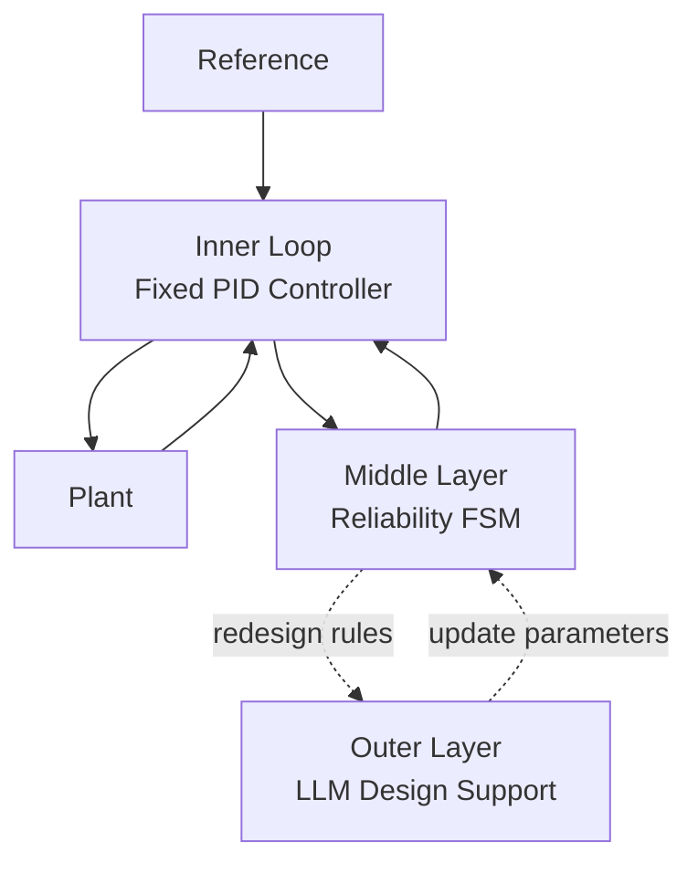

# B-Type Architecture  
## PID × FSM × LLM Reliability-Oriented Control Stack

---

## Architectural Intent

The B-Type architecture is designed to **explicitly separate control execution from reliability judgment**.

Rather than embedding adaptation logic directly into the control loop,  
B-Type introduces a layered structure in which:

- **PID** guarantees baseline stability  
- **FSM** decides whether adaptation is allowed  
- **LLM** supports redesign and explanation outside real-time constraints  

This separation ensures that **reliability constraints dominate performance optimization**.

---

## Layered Architecture Overview

---

## Inner Loop: PID Controller

### Role
The PID controller forms the **core real-time control loop**.

### Design Characteristics
- Fixed, conservative gains
- Designed with sufficient gain and phase margins
- No online structural modification

### Design Rationale
The PID loop must remain stable **regardless of higher-layer decisions**.

> In B-Type, the PID controller is never optimized aggressively.  
> It exists to guarantee a *minimum safe control authority*.

---

## Middle Layer: FSM (Reliability Guard)

### Role
The FSM supervises the PID loop and determines **whether adaptive actions are permitted**.

### FSM Responsibilities
- Monitor reliability metrics derived from plant response
- Compare metrics against predefined thresholds
- Select control modes accordingly

### Representative FSM States
- **NORMAL**: Nominal operation, no significant degradation  
- **DEGRADED**: Degradation detected, adaptation under consideration  
- **ADAPT_ALLOWED**: Adaptation permitted within limits  
- **ADAPT_BLOCKED**: Adaptation explicitly prohibited  
- **SAFE_MODE**: Forced fallback to fixed PID operation  

### Key Principle
The FSM must explicitly support  
**“the decision to block adaptation.”**

This is the defining difference between A-Type and B-Type.

---

## Outer Layer: LLM (Design-Time Intelligence)

### Role
The LLM operates **outside the real-time control loop** and acts as a design assistant.

### Typical Functions
- Propose new FSM guard thresholds
- Suggest alternative PID parameter sets
- Analyze long-term reliability trends
- Generate human-readable explanations of control decisions

### Non-Responsibilities
- No direct real-time control
- No continuous parameter injection into the PID loop

> The LLM influences *design evolution*, not *instantaneous control*.

---

## Information Flow and Time Scales

| Layer | Time Scale | Responsibility |
|---|---|---|
| PID | Continuous / real-time | Stabilization and tracking |
| FSM | Discrete / supervisory | Reliability-based mode selection |
| LLM | Offline / asynchronous | Redesign and explanation |

This strict separation prevents unstable feedback between learning, supervision, and control.

---

## Architectural Guarantees

The B-Type architecture guarantees that:

1. The control loop remains stable even if adaptation is disabled  
2. Adaptive behavior is constrained by explicit reliability metrics  
3. Long-term degradation does not lead to uncontrolled compensation  
4. System behavior remains interpretable and explainable  

---

## Relation to A-Type Architecture

- A-Type focuses on *how adaptation can be performed*
- B-Type focuses on *when adaptation must be restricted*

B-Type should be understood as a **supervisory envelope** placed around the A-Type adaptive mechanisms.

---

## Summary

The B-Type architecture formalizes a key control principle:

> **Performance optimization must never override reliability constraints.**

By layering PID, FSM, and LLM with clearly separated roles and time scales,  
B-Type provides a robust foundation for adaptive control under long-term plant degradation.

---

The next section details:
- Formal definitions of reliability metrics  
- FSM guard conditions and threshold logic

