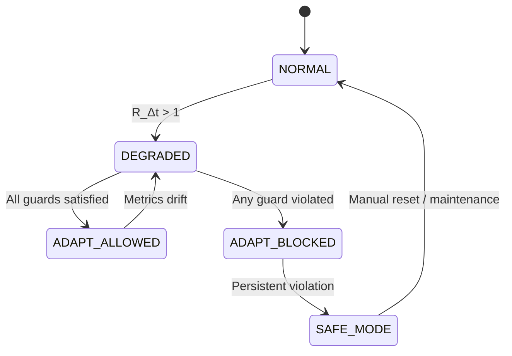

# FSM Reliability Guard  
## Metric Definitions and Decision Logic

---

## Purpose of the FSM Reliability Guard

The FSM Reliability Guard is the **core mechanism** that distinguishes  
AITL Controller **B-Type** from A-Type.

Its purpose is not to improve performance, but to **prevent adaptation from degrading reliability**.

> The FSM answers a single critical question:  
> **“Is adaptation allowed under the current reliability condition?”**

---

## Reliability Metrics Overview

The FSM evaluates system health using **dimensionless, normalized metrics**.  
This ensures robustness across operating points and plant variations.

Primary monitored quantities:

1. **Response delay ratio** $R_{\Delta t} = \Delta t / \Delta t_0$  
2. **Gain compensation ratio(s)** $R_{K_P}, R_{K_I}, R_{K_D}$  
3. **Amplitude / authority ratio** $R_A$ and **saturation indicators**  
4. **Adaptation frequency** $N_{\text{adapt}}$ (optional; anti-chattering)

> **Note:** In the current A-Type demos, adaptation mainly adjusts **$K_P$**.  
> Therefore, B-Type may start with $R_{K_P}$ as the primary gain guard,
> and later extend to $K_I, K_D$ if needed.

---

## Metric 1: Response Delay Ratio ($\Delta t / \Delta t_0$)

### Definition

Let:

- $\Delta t_0$ : nominal response delay under healthy plant conditions  
- $\Delta t$   : measured response delay under current conditions  

The normalized delay ratio is defined as:

$$
R_{\Delta t} = \frac{\Delta t}{\Delta t_0}
$$

---

### How to Measure $\Delta t$ (Operational Definition)

To avoid ambiguity, B-Type defines $\Delta t$ using **event-to-event timing**.

A practical and reproducible definition (used in the A-Type sweep):

- Choose a reference event time $t_{\text{event}}$  
  (e.g., disturbance start, reference step, command change)
- Define $\Delta t$ as the **settling recovery time** after $t_{\text{event}}$

Let the tracking error be:

$$
e(t) = I_{\text{ref}}(t) - I(t)
$$

Choose:
- settle band $|e(t)| < \epsilon$
- hold duration $T_{\text{hold}}$

Then $\Delta t$ is defined as:

$$
\Delta t
=
\min_{t \ge t_{\text{event}}}
\left\{
t - t_{\text{event}}
\;\middle|\;
|e(\tau)| < \epsilon,\;
\forall \tau \in [t,\, t + T_{\text{hold}}]
\right\}
$$

This definition is:
- deterministic  
- unit-consistent  
- implementable in both simulation and runtime systems  

---

### Interpretation

- $R_{\Delta t} \approx 1$ : nominal timing behavior  
- $R_{\Delta t} > 1$ : degradation-induced delay  
- Large values indicate loss of responsiveness and/or control authority  

---

### Guard Threshold

$$
R_{\Delta t} \le R_{\Delta t}^{\max}
$$

If violated, **adaptation must be blocked**.

---

## Metric 2: Gain Compensation Ratio ($K / K_0$)

### Definition (per gain)

Let:

- $K_{P0}, K_{I0}, K_{D0}$ : nominal gains  
- $K_P, K_I, K_D$         : current gains  

Define per-gain ratios:

$$
R_{K_P} = \frac{K_P}{K_{P0}}, \quad
R_{K_I} = \frac{K_I}{K_{I0}}, \quad
R_{K_D} = \frac{K_D}{K_{D0}}
$$

If only $K_P$ is adapted, then $R_{K_P}$ is the primary guard.

---

### Interpretation

- $R_{K_*} \approx 1$ : nominal control effort  
- $R_{K_*} \gg 1$ : over-compensation risk  
- Excessive gain escalation often precedes saturation or instability  

---

### Guard Threshold

$$
R_{K_P} \le R_{K_P}^{\max}, \quad
R_{K_I} \le R_{K_I}^{\max}, \quad
R_{K_D} \le R_{K_D}^{\max}
$$

Violation indicates **unsafe compensation**.

---

### Rate Guard (Adaptation Aggressiveness)

Even if absolute gains are within limits, rapid gain changes are risky.

For $K_P$, define:

$$
R_{\dot K_P}
=
\frac{\left|K_P(t) - K_P(t-\Delta T)\right|}{K_{P0}}
$$

Guard condition:

$$
R_{\dot K_P} \le R_{\dot K_P}^{\max}
$$

---

## Metric 3: Amplitude / Authority Ratio and Saturation

### Definition

Let:

- $A_{\text{out}}$ : output response amplitude  
- $A_{\text{ref}}$ : reference amplitude  

The amplitude ratio is:

$$
R_A = \frac{A_{\text{out}}}{A_{\text{ref}}}
$$

Additionally, actuator saturation indicators may be monitored, e.g.:

- saturation time ratio $S_u$

---

### Interpretation

- Excessive amplitude indicates loss of damping  
- Frequent saturation implies erosion of motion authority  

---

### Guard Usage

Amplitude and saturation metrics are typically used as **secondary guards**  
or as part of a reliability cost function.

Example:

$$
R_A \le R_A^{\max}, \quad
S_u \le S_u^{\max}
$$

---

## Optional Metric: Adaptation Frequency (Chattering Detection)

### Definition

Let:

- $N_{\text{adapt}}$ : number of adaptation events per observation window  

Guard condition:

$$
N_{\text{adapt}} \le N_{\text{adapt}}^{\max}
$$

Violation triggers adaptation blocking to prevent oscillatory redesign.

---

## Permission Logic (Minimal Specification)

Adaptation is permitted **only if all guard conditions are satisfied**:

$$
\begin{aligned}
R_{\Delta t} &\le R_{\Delta t}^{\max} \\
R_{K_P}      &\le R_{K_P}^{\max} \\
R_{\dot K_P} &\le R_{\dot K_P}^{\max} \\
\text{(optional)}\quad R_A &\le R_A^{\max} \\
\text{(optional)}\quad S_u &\le S_u^{\max}
\end{aligned}
$$

If **any** condition is violated:

- Adaptation is **disabled**
- Controller **falls back to fixed-gain PID**
- FSM enters a **reliability protection state**

> Blocking adaptation is a **correct and expected outcome** in B-Type.

---

## FSM State Transitions

---

## Design Implications

- Adaptation is **explicitly constrained**, not implicitly discouraged  
- Performance improvement never overrides reliability limits  
- Long-term degradation naturally drives the system toward conservative control  

> In B-Type, *blocking adaptation is a correct design outcome*.

---

## Summary

The FSM Reliability Guard provides:

- Formal, quantitative reliability definitions  
- Explicit measurement semantics for $\Delta t$  
- Deterministic permission logic for adaptation  
- Guaranteed fallback to fixed PID  

By enforcing these guard conditions,  
B-Type transforms adaptive control into a **reliability-aware supervisory architecture**.

---

## Next Sections

- Reliability cost function formulation  
  → [`reliability_cost.md`](reliability_cost.md)

- Guard threshold design guidelines  
  → [`threshold_guidelines.md`](threshold_guidelines.md)

- Demo mapping and integration  
  → [`demo_mapping.md`](demo_mapping.md)
