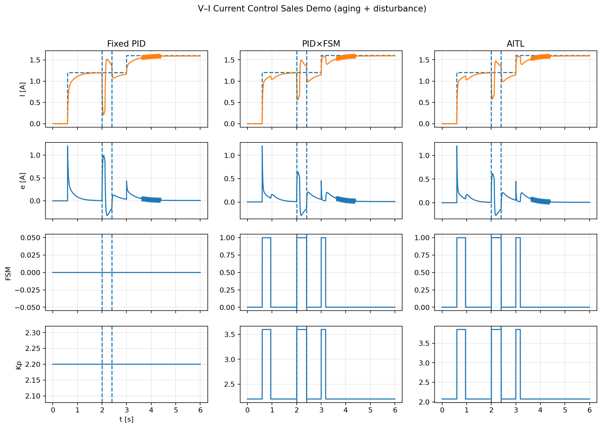
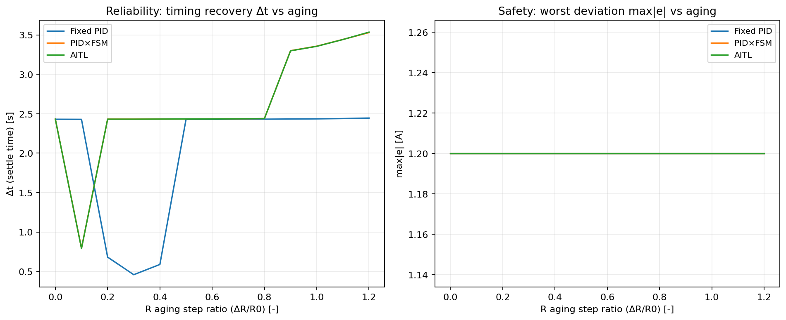
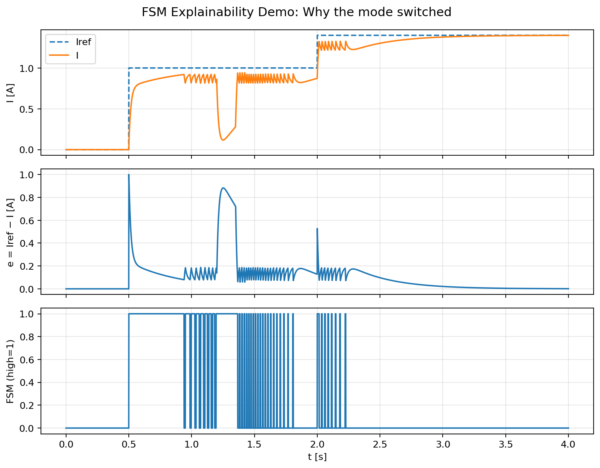

# Reliability Analysis — AITL under Plant Aging (1000 days)

This section provides a **reliability-oriented analysis** of the  
**AITL Controller A-Type** under **long-term plant degradation**,  
modeled as **friction aging equivalent to 1000 days**.

Unlike conventional performance-driven evaluations,  
the focus here is on **temporal reliability**:

- ⏱️ timing consistency (Δt)
- 🎛️ motion authority preservation
- 🚫 explicit decisions on *when adaptation should be stopped*

---

## 🔗 Links

| Language | GitHub Pages 🌐 | GitHub 💻 |
|----------|----------------|-----------|
| 🇺🇸 English |  |  |

---

## 🎯 Purpose and Scope

The goal of this analysis is **not** to optimize controller performance.

Instead, it aims to answer the following design questions:

- How does plant aging affect response timing?
- What does adaptive control *actually* preserve?
- When does adaptation begin to **harm reliability**?
- Can this degradation be **quantified and detected by design**?

The analysis compares:

- fixed-gain PID control  
- AITL control with FSM-based adaptive gain retuning  

under identical friction aging conditions.

---

## 🧩 Analysis Structure (Demo Mapping)

This reliability study is organized as a **design-to-evidence sequence**,
linking **architectural intent** to **reproducible results**.

Rather than independent experiments, each demo represents a
**progressive refinement of reliability reasoning**.

| Demo | Artifact | Role |
|------|----------|------|
| **12** | `12_vi_current_control_sales_demo.py` | Phenomenon visualization (waveforms under aging & disturbance) |
| **13** | `13_aging_sweep_delta_t.py` | Quantitative reliability metrics (Δt, max\|e\| vs aging) |
| **15** | `15_fsm_explainability_demo.py` | Explainable supervisory decisions (FSM transition rationale) |
| **—** | *(design synthesis)* | Reliability boundary identification (motivation for B-Type) |

### Interpretation

- **Demo 12** answers *what happens* under aging and disturbance  
- **Demo 13** quantifies *how reliability degrades* using explicit metrics  
- **Demo 15** explains *why supervisory decisions occur*, enabling auditability  

Together, these demos establish that:

- performance recovery alone is insufficient to guarantee reliability
- temporal consistency (Δt) must be monitored explicitly
- adaptive actions require **design-time permission and stopping logic**

This sequence defines the **design boundary of the A-Type controller** and
provides the **evidence base** motivating a reliability-oriented **B-Type architecture**.

Each demo builds on the previous one and represents a  
**design-phase progression**, not isolated experiments.

---

## 🔬 Demonstration Results (Reproducible Evidence)

This section presents **direct, reproducible results** generated from the
Python demos in `demos/` and stored in `data/`.

All figures below are **auto-generated** and traceable to code.

---

### 1️⃣ V–I Current Control under Aging & Disturbance

Waveform comparison of **Fixed PID / PID×FSM / AITL** under:
- resistance (friction-equivalent) aging
- external current disturbance

**Observations**
- Fixed PID: recovery depends on nominal tuning
- PID×FSM: supervised gain switching improves robustness
- AITL: adaptive recovery under degradation

⚠️ Waveforms alone are **not sufficient** to judge reliability.  
Quantitative metrics follow.

---

### 2️⃣ Reliability & Safety Metrics vs Aging (Δt, max\|e\|)

Aging sweep over resistance step ratio (ΔR/R0), evaluating:
- **Δt**: recovery/settling time (temporal reliability)
- **max\|e\|**: worst deviation (safety envelope)

**Interpretation**
- Δt increases with aging for all controllers
- AITL maintains comparable safety (max\|e\|)
- Temporal reliability degradation becomes **explicit and measurable**

---

### 3️⃣ FSM Explainability — Why Adaptation Switched

Explicit visualization and logs explaining **why FSM mode switches occurred**,
based on thresholded error magnitude.

**What this proves**
- Supervisory decisions are deterministic
- Mode switches are auditable and timestamped
- FSM-based adaptation is **not a black box**

---

## ♻️ Reproducibility

All results shown above are generated by the following scripts:

- `demos/12_vi_current_control_sales_demo.py`
- `demos/13_aging_sweep_delta_t.py`
- `demos/15_fsm_explainability_demo.py`

Generated figures are stored in:

- `data/12_vi_current_control_sales_demo.png`
- `data/13_aging_sweep_delta_t.png`
- `data/15_fsm_explainability_demo.png`

No manual post-processing is applied.

---

## 🧠 Reliability Design Conclusion (Evidence-Based)

Based on the results above:

- adaptive control can compensate for aging-induced delay
- adaptation may degrade temporal reliability
- this degradation is detectable by design-time metrics (Δt)
- FSM-based logic can decide **when adaptation should be stopped**

These results define the **design boundary** of the A-Type controller and
motivate a **B-Type architecture explicitly designed for reliability control**.

---

## 🧩 Key Design Message

> **Adaptive control is not automatically reliable.**

In this study, AITL successfully compensates for delay,  
but at the cost of:

- excessive lead (over-compensation)
- reduced motion authority
- and degraded overall reliability

Crucially, these effects are:

- **not obvious from waveforms alone**
- but become explicit through Δt, amplitude, and FSM logic

This distinction marks the boundary between  
*performance optimization* and *reliability-oriented design*.

---

## 🧭 Navigation

### ▶ Detailed Demo Analyses (Reproducible Results)

- **Demo 12 — V–I Current Control under Aging & Disturbance**  
  Phenomenological waveform comparison (Fixed PID / PID×FSM / AITL)  
  → Results: `data/12_vi_current_control_sales_demo.png`  
  → Code: `demos/12_vi_current_control_sales_demo.py`

- **Demo 13 — Reliability Metrics vs Aging (Δt, max\|e\|)**  
  Quantitative evaluation of temporal reliability and safety degradation  
  → Results: `data/13_aging_sweep_delta_t.png`  
  → Code: `demos/13_aging_sweep_delta_t.py`

- **Demo 15 — FSM Explainability (Why Adaptation Switched)**  
  Audit-ready visualization of supervisory decisions and thresholds  
  → Results: `data/15_fsm_explainability_demo.png`  
  → Code: `demos/15_fsm_explainability_demo.py`

These demos constitute the **evidence layer** supporting the
reliability conclusions of the A-Type controller.

---

## 🖼 Reference Figure

- **Timing degradation under friction aging**  
  [pid_vs_aitl_friction_aging.png](
  https://samizo-aitl.github.io/aitl-controller-a-type/data/pid_vs_aitl_friction_aging.png
  )

This figure provides a *phenomenological overview* only.  
All reliability conclusions are derived from quantitative metrics  
and FSM-based decisions described in the demos above.

---

## 🔗 Relation to Other Documentation

- This section corresponds to the **Reliability Investigation**  
  introduced briefly in the main documentation index.
- The index page presents only representative conclusions.
- Detailed reasoning, metrics, and design implications are contained here.

---

## ✅ Summary

This reliability chapter demonstrates that:

- timing degradation can be quantified (Δt)
- authority loss can be detected (amplitude ratio)
- adaptive behavior can and **should be stopped by design**

The result is not a failure of AITL,  
but a **clear design boundary** between:

> *Adaptive* control  
> and  
> *Reliable adaptive* control

---

## ➡️ Design Implication and Next Step

The A-Type controller successfully demonstrated adaptive control capability
under plant aging conditions.

While the feasibility of reliability-oriented control was investigated,
the current A-Type architecture was not designed to guarantee reliability,
as adaptive actions may degrade timing consistency and motion authority.

This result clarifies the design boundary of the A-Type controller and
motivates the investigation of a **B-Type architecture explicitly designed
for reliability control**, in which adaptive actions are evaluated and
accepted only if overall reliability is improved.
